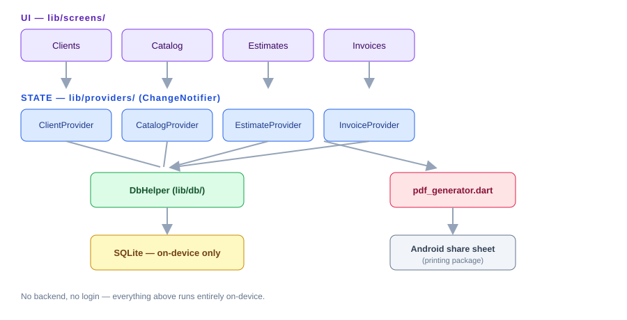
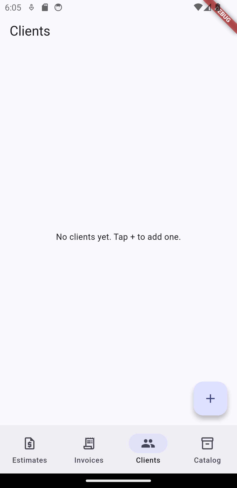
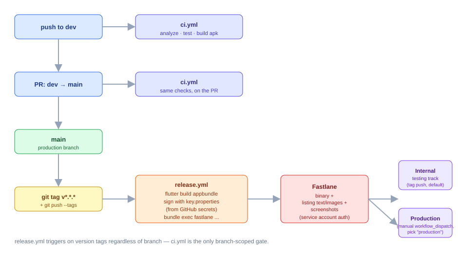

# Full Project Guide — ITMC Bussines OS

This is the single comprehensive reference for this project: what it is, how
it's built, how to run/test/publish it, and — since this repo is meant to be
reused as a starting point for future projects — exactly what to change to
adapt it into a brand-new app. Shorter, task-focused docs also exist (see
[docs/README.md](README.md) for the full index — `GETTING_STARTED.md`,
`RUNNING.md`, `PUBLISHING.md`, `FASTLANE.md`, `play-console-manual-steps.md`,
`store-listing-answers.md`); this doc ties everything together in one place
and adds the "reuse this as a template" and "lessons learned" material that
doesn't belong in a quick-start.

## Table of contents

1. [What this is](#1-what-this-is)
2. [Architecture](#2-architecture)
3. [Folder structure / file manifest](#3-folder-structure--file-manifest)
4. [Environment setup](#4-environment-setup)
5. [Running & testing](#5-running--testing)
6. [Branching & CI](#6-branching--ci)
7. [Publishing to Google Play](#7-publishing-to-google-play)
8. [Reusing this repo as a template for a new project](#8-reusing-this-repo-as-a-template-for-a-new-project)
9. [Lessons learned / troubleshooting](#9-lessons-learned--troubleshooting)

---

## 1. What this is

A local-first Flutter app (**ITMC Bussines OS**, Dart package name
`itmc_estimator`) for a software/development service business: manage
clients, a reusable service-price catalog, cost estimates, and invoices,
with PDF export. No login, no backend — everything lives on-device.

Beyond the app itself, this repo is a working example of a **fully
automated Google Play release pipeline**: tag a version, and CI builds,
signs, and uploads the binary plus the entire store listing (text, icon,
feature graphic, screenshots) with zero manual Play Console form-filling
for anything recurring.

## 2. Architecture



- **`lib/screens/`** — UI, one folder per feature area (clients, catalog,
  estimates, invoices), each with a list screen + form screen (+ detail
  screen for estimates/invoices).
- **`lib/providers/`** — one `ChangeNotifier` per entity, wrapping
  `DbHelper`. Screens read/write through these via the `provider` package;
  no screen talks to the database directly.
- **`lib/db/db_helper.dart`** — a `sqflite` singleton: schema + CRUD for all
  4 tables (clients, service_catalog, estimates, invoices). Estimates/
  invoices store their line items as a JSON column rather than a separate
  table — simpler for this scale, revisit if line items ever need
  independent querying.
- **`lib/pdf/pdf_generator.dart`** — pure function, bytes in (estimate/
  invoice + client) → bytes out (PDF). Screens call `Printing.sharePdf` with
  those bytes to hand off to Android's native share sheet.
- **`lib/models/`** — plain Dart classes, no codegen. `toMap`/`fromMap` for
  direct-column models (`Client`), `toJson`/`fromJson` for the embedded
  line-items list.

## 3. Folder structure / file manifest

```text
lib/                          The app itself (see architecture above)
android/                      Flutter's generated Android project
  app/build.gradle.kts        Signing config reads android/key.properties (git-ignored)
  key.properties.example      Template — copy to key.properties, fill in real values
fastlane/
  Appfile                     package_name + json_key_file path
  Fastfile                    Lanes: build_release, screenshots, deploy_internal, deploy_production
  metadata/android/en-US/     Store listing text, changelog, icon/feature graphic, screenshots
                              — this whole folder is what gets pushed to Play Console automatically
  play-service-account.json   Google Cloud service account key (git-ignored, not in repo)
scripts/
  capture_screenshots.sh      Auto-captures Play Store screenshots via adb (no manual screenshotting)
  generate_placeholder_graphics.ps1   Generates a placeholder icon/feature graphic
.github/workflows/
  ci.yml                      Lint/test/build gate — runs on push to dev, PRs into main
  release.yml                 Build+sign+upload — runs on version tags (any branch), or manual dispatch
Dockerfile                    Reproducible release-build image (not needed for day-to-day dev)
docs/
  README.md                   Index of all docs, ordered by when you'd reach for them
  FULL_GUIDE.md               This file
  GETTING_STARTED.md          Quick-start checklist, phase by phase
  RUNNING.md                  Local dev/test setup, golden-path test script
  PUBLISHING.md               One-time Play Console/Cloud setup, in detail
  FASTLANE.md                 What Fastlane is, the lanes in this repo, how to run one locally
  play-console-manual-steps.md  Click-by-click Play Console UI walkthrough (testers,
                              countries, content rating, release, submit for review)
  store-listing-answers.md    Exact answers for the content-rating + data-safety forms
  privacy-policy.md           Hosted live via GitHub Pages, linked from the Play listing
  images/                     Diagrams and reference screenshots for these guides
legacy-appcreator24/          The original AppCreator24-built .aab, kept for reference only
```

## 4. Environment setup

See **[GETTING_STARTED.md, Phase 1](GETTING_STARTED.md#phase-1--install-the-development-environment)**
for the from-scratch checklist (Flutter SDK, Android SDK, one emulator).
Once `flutter doctor` reports clean, you're ready for everything else in
this doc.

## 5. Running & testing

```bash
flutter pub get
flutter run
```

Requires an Android emulator or physical device — this app can't run
correctly on Windows desktop or web targets, because `sqflite` (local
storage) has no real implementation there. Full golden-path manual test
script → **[RUNNING.md](RUNNING.md)**.

Real screenshot from this app running on the emulator during development:



## 6. Branching & CI



- **`main`** — production. Only receives merges (via PR) and release tags.
- **`dev`** — where ongoing work happens. Push here for day-to-day changes.
- **`ci.yml`** — runs `flutter analyze` / `flutter test` / `flutter build
  apk --debug` on every push to `dev` and every PR into `main`. This is a
  quality gate, separate from publishing.
- **`release.yml`** — runs on any push of a `v*.*.*` tag (regardless of
  branch), or manually via GitHub → Actions → "Release to Google Play" →
  "Run workflow" (lets you pick internal or production track directly).

Normal flow: work on `dev` → PR into `main` → CI passes → merge → tag a
release from `main`.

## 7. Publishing to Google Play

Full one-time setup and the ongoing release command are in
**[PUBLISHING.md](PUBLISHING.md)**. Short version: after the one-time setup
(Play Console app creation, signing key, Google Cloud service account,
GitHub secrets), every release is:

```bash
git tag v1.0.1 && git push origin v1.0.1
```

Content rating questionnaire and data safety form answers (both one-time,
manual — no API exists for either) → **[store-listing-answers.md](store-listing-answers.md)**.
Exact click path through every Play Console screen involved (testers,
countries/regions, content rating, target audience, data safety, ads,
health apps, creating the production release, submitting for review) →
**[play-console-manual-steps.md](play-console-manual-steps.md)**.

## 8. Reusing this repo as a template for a new project

Everything below is what to change when starting a genuinely new app from
this boilerplate — not just renaming this one, but adapting the whole
pipeline for a different app entirely.

### 8.1 Code identity

- [ ] `pubspec.yaml` → `name:` (Dart package name, snake_case)
- [ ] `android/app/build.gradle.kts` → `namespace` and `applicationId`
  (reverse-domain, e.g. `com.itmc.new_app_name`) — or just re-run
  `flutter create --project-name <name> --org <org> .` fresh and re-apply
  the `android/app/build.gradle.kts` signing-config changes from this repo
  (see `git log -- android/app/build.gradle.kts` here for exactly what to
  port over)
- [ ] `android/app/src/main/AndroidManifest.xml` → `android:label` (the
  user-visible app name)
- [ ] `lib/main.dart` → `MaterialApp(title: ...)`
- [ ] Replace `lib/models/`, `lib/db/`, `lib/providers/`, `lib/screens/`,
  `lib/pdf/` with the new app's actual features — the *pattern*
  (models → DbHelper → providers → screens, pure-function PDF generation)
  is what's reusable, not the specific Client/Estimate/Invoice content

### 8.2 App icon & branding

- [ ] Put real artwork at `assets/icon/icon.png`, run
  `dart run flutter_launcher_icons` (already configured in `pubspec.yaml`)
- [ ] Regenerate or replace `fastlane/metadata/android/en-US/images/icon.png`
  and `featureGraphic.png` (placeholders come from
  `scripts/generate_placeholder_graphics.ps1` — edit the text/colors in
  that script for a quick placeholder, or drop in real designed assets)
- [ ] Update `scripts/capture_screenshots.sh`'s default package name
  argument to match the new `applicationId`

### 8.3 Store listing content

- [ ] `fastlane/metadata/android/en-US/title.txt`, `short_description.txt`,
  `full_description.txt`
- [ ] `fastlane/metadata/android/en-US/changelogs/<versionCode>.txt`
- [ ] `docs/privacy-policy.md` — rewrite to reflect what the *new* app
  actually does. Don't reuse this app's "we collect nothing" policy if the
  new app has a backend, accounts, or analytics — that would be a false
  legal declaration.
- [ ] `fastlane/Appfile` → `package_name(...)` must match the new
  `applicationId` exactly

### 8.4 Signing & credentials (never share these across apps)

- [ ] Generate a **new, separate** signing keystore for the new app —
  never reuse an existing app's upload key for an unrelated app
- [ ] Create a **new** Google Cloud project (or a new service account
  within an existing one) for the new app's Play Developer API access —
  see the full walkthrough in [PUBLISHING.md, step 4](PUBLISHING.md#4-connect-google-cloud-to-play-console-service-account--api-access)
- [ ] Create the new app in Play Console with its own package name —
  **copy-paste it, don't retype it** (see [§9](#9-lessons-learned--troubleshooting)
  for why this matters so much)
- [ ] Set the same 5 GitHub secrets on the *new* repo (they're per-repo,
  never shared): `ANDROID_KEYSTORE_BASE64`, `ANDROID_KEYSTORE_PASSWORD`,
  `ANDROID_KEY_ALIAS`, `ANDROID_KEY_PASSWORD`, `PLAY_SERVICE_ACCOUNT_JSON`
- [ ] Enable GitHub Pages on the new repo (Settings → Pages → branch
  `main`, folder `/docs`) for the new privacy policy URL

### 8.5 Repo setup

- [ ] Create the new repo, `git init`, push
- [ ] Create `dev` branch, open the initial PR-based workflow (see §6)
- [ ] Re-run through [GETTING_STARTED.md](GETTING_STARTED.md) top to
  bottom for the new app, phase by phase — it's already written generically
  enough to reuse directly, just double-check each phase's specifics match
  the new app

## 9. Lessons learned / troubleshooting

Real issues hit while building this pipeline, so a future project built
from this template doesn't have to rediscover them:

- **Google Play package names are permanent.** The instant an app is
  created in Play Console, its package name can never be changed. We hit
  this directly: a typo (`com.itmc.itmc_estimato`, missing the final "r")
  meant the whole app had to be deleted and recreated rather than fixed.
  **Always copy-paste the package name; never retype it.**

- **Gradle's `file()` in `android/app/build.gradle.kts` resolves relative
  paths against `android/app/`, not the project root.** A CI step that
  decodes the signing keystore needs to write it to `android/app/`
  specifically, or the build fails with "Keystore file ... not found" even
  though the file exists somewhere else in the repo.

- **Fastlane's working directory during lane execution isn't something to
  guess at.** Relative paths (`"../build/..."`) that happened to work
  interactively broke in CI. Fix: anchor every path in the `Fastfile` to an
  absolute location via `File.expand_path("..", __dir__)`, never assume a
  particular `Dir.pwd`.

- **Google restructured Play Console's API access flow** and removed the
  separate "link a Google Cloud project" page entirely. Service accounts
  now get access the same way a human teammate would: Play Console →
  "Users and permissions" → "Invite new users" → paste the service
  account's email. If a guide (including an older version of this one)
  mentions a standalone "API access" page, it's outdated.

- **GitHub Actions redacts every occurrence of a secret's literal value
  anywhere in log output** — including inside unrelated words. Since one
  of our secrets' value was literally `upload`, log lines like
  `upload_to_play_store` rendered as `***_to_play_store`. Cosmetic only,
  not a real error — but confusing if you don't know it's happening.

- **Antivirus HTTPS-scanning (e.g. Avast) can break Gradle's dependency
  downloads on Windows**, because the JVM doesn't automatically trust
  what's in the OS certificate store. Fix it in your own
  `~/.gradle/gradle.properties` (a per-machine file, never commit this
  workaround into a shared project's `android/gradle.properties` — it
  won't exist on anyone else's machine or in CI).

- **A pasted/attached chat image isn't automatically a file on disk.** If
  an AI assistant needs to use an image you've shared (e.g. an app icon),
  it may need you to save it to an actual path it can read, rather than
  just "seeing" it in the conversation.
